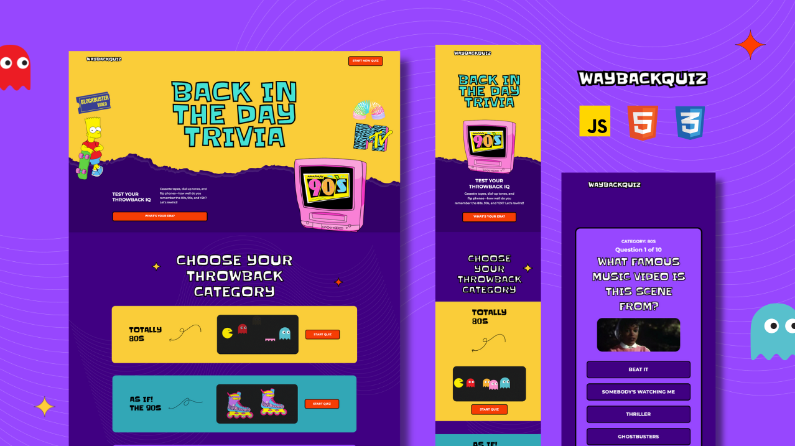

# 🤩 WayBackQuiz 

### 🕹️ Test Your Throwback IQ!

WayBackQuiz is a fun and nostalgic trivia game to test your knowledge of pop culture from the **80s, 90s, and Y2K eras**. From **classic cartoons and video games** to **iconic music videos and legendary catchphrases**, this game is a blast from the past!

## 📸 Screenshot
  

## 🎯 How to Play
1. **Select a category**: Choose between **Totally 80s, As If! The 90s, or Rewind to Y2K**.
2. **Answer the trivia questions**: Each question includes an image, and you must select the correct answer from four options.
3. **See your results**: At the end of the game, you will see your final score.
4. **Try again**: You can play again, or choose another category.

## 🚀 Live Demo
[🎮 Play WayBackQuiz Here](https://latrishagomer.github.io/quiz-game-project-1/index.html)

## 🛠️ Technologies Used
- **HTML**: Structured the game layout and elements.
- **CSS**: Styled the game using Flexbox, Grid, and custom fonts.
- **JavaScript**: Managed game logic, interactions, and dynamic content updates.
- **LocalStorage API**: Stored selected categories across pages.
- **GitHub Pages**: Deployed and hosted the game.

## 📝 Attributions
- Trivia questions and images sourced from **public domain resources**. 
- I do not own or claim to own the rights to any of the photos used in this project.
- Background images and icons from **Envato Elements**, **Canva**, and **Etsy**.
- Sound effects from **Envato Elements**.

## 🔮 Future Enhancements
🔹 **Add a Timer**: Players must answer within a time limit.  
🔹 **More Categories & Questions**: Expand to include **60s,70s** and other topics.  
🔹 **Multiplayer Mode**: Compete with friends in real-time!  

---

💡 *WayBackQuiz was built as a fun throwback project. Enjoy the nostalgia and see if you remember your childhood favorites!*  
